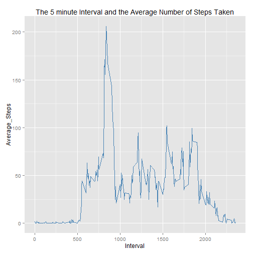

#**Reproducible Research: Course Assignment 01**
####- An Analysis on the data gathered by a Personal Activity monitoring device

##Introduction
This analysis is done for the Course Assignment 01 of Reproducible Research
The data is analysed step by step as instructed to get an idea about the dataset given for the analysis.

This assignment uses the data from a personal activity monitoring device. This device collects data at 5 minute intervals through out the day. The data consists of two months of data from an anonymous individual collected during the months of October and November, 2012 and include the number of steps taken in 5 minute intervals each day.

The data for this assignment can be downloaded from the following web link:

Dataset: [Activity monitoring data](https://d396qusza40orc.cloudfront.net/repdata%2Fdata%2Factivity.zip)

##Analysis of the Data of a Personal Activity Monitoring Device
###Loading and Preprocessing the Data

Load the data into a variable - 'activity'

```r
activity <- read.csv("activity.csv",
                     header = TRUE,
                     sep = ",",
                     na.strings = "NA",
                     colClasses = c("integer", "Date", "integer"))
```

Checking it's dimension & structure

```r
dim(activity)
```

```
## [1] 17568     3
```

```r
str(activity)
```

```
## 'data.frame':	17568 obs. of  3 variables:
##  $ steps   : int  NA NA NA NA NA NA NA NA NA NA ...
##  $ date    : Date, format: "2012-10-01" "2012-10-01" ...
##  $ interval: int  0 5 10 15 20 25 30 35 40 45 ...
```

###Mean of total Number of Steps taken per day

```r
totalSteps <- aggregate(activity$steps,
                        by = list(activity$date),
                        FUN = "sum",
                        na.rm = TRUE)
names(totalSteps) <- c("Day", "Total_Steps")
```

Histogram of of the total number of steps taken each day

```r
library(ggplot2)
qplot(totalSteps$Total_Steps,
      binwidth = 1000,
      fill=I("steelblue"), 
      col=I("gray"),
      main = "Histogram of the Total Number of Steps Taken Each Day",
      xlab = "Total Number of Steps")
```


The mean and median of the total number of steps taken per day

```r
mean(totalSteps$Total_Steps)
```

```
## [1] 9354.23
```

```r
median(totalSteps$Total_Steps)
```

```
## [1] 10395
```

###The Average Daily Activity Pattern

```r
avgStepsInt <- aggregate(activity$steps,
                         by = list(activity$interval),
                         FUN = "mean",
                         na.rm = TRUE)
names(avgStepsInt) <- c("Interval", "Average_Steps")
```

Make a time series plot of the 5-minute interval and the average number of steps taken, averaged across all days

```r
g <- ggplot(avgStepsInt, aes(Interval, Average_Steps))
g + geom_line(color = "steelblue") + labs(title = "The 5 minute Interval and the Average Number of Steps Taken")
```



Which 5-minute interval, on average across all the days in the dataset, contains the maximum number of steps?

```r
avgStepsInt[which.max(avgStepsInt$Average_Steps),"Interval"]
```

```
## [1] 835
```

###Imputing Missing values (NA)
Calculating the total number of missing values in the dataset

```r
sum(is.na(activity$steps))
```

```
## [1] 2304
```

Implementing a strategy for filling in all of the missing values in the dataset. The mean value of the interval is replaced for missing values

```r
activityFilled <- activity
activityFilled[is.na(activity$steps), "steps"] <- mean(activity$steps,
                                                       na.rm = TRUE)
```

A new dataset (activityFilled) that is equal to the original dataset but with the missing data filled in has been created.

```r
sum(is.na(activityFilled$steps))
```

```
## [1] 0
```
All missing values are replaced


```r
totalStepsFilled <- aggregate(activityFilled$steps,
                              by = list(activityFilled$date),
                              FUN = "sum")
names(totalStepsFilled) <- c("Day", "Total_Steps")
```

A new histogram of the total number of steps taken each day

```r
qplot(totalStepsFilled$Total_Steps,
      binwidth = 1000,
      fill=I("steelblue"), 
      col=I("gray"),
      main = "Histogram of the total number of steps taken each day\n NA Replaced",
      xlab = "Total Number of Steps")
```


The mean and median total number of steps taken per day are calculated again.

```r
mean(totalStepsFilled$Total_Steps)
```

```
## [1] 10766.19
```

```r
median(totalStepsFilled$Total_Steps)
```

```
## [1] 10766.19
```
These values differ from the estimates from the first part. Imputing missing data on the estimates of the total daily number of steps have significanly increased the mean and median of the total daily number of steps.
The Histogram too indicates that the values differ from the estimates from the first Histogram.

###The Activity Patterns Between Weekdays and Weekends
Some transformation are made on the data to observe whether there are differences in activity patterns between weekdays and weekends.

Creating a new factor variable in the dataset with two levels - "weekday" and "weekend" indicating that a given date is a weekday or weekend day.

```r
activityFilled$week <- as.factor(weekdays(activity$date))
activityFilled$day <- as.factor(ifelse
                                (activityFilled$week == "Sunday"|
                                  activityFilled$week == "Saturday", "Weekend", "Weekday"))
```

Getting average steps for intervals

```r
avgStepsDay <- aggregate(activityFilled$steps,
                         by = list(activity$interval, activityFilled$day),
                         FUN = "mean")
names(avgStepsDay) <- c("Interval", "Day", "Average_Steps")
```

Make a Panel Plot containing a time series plot of the 5-minute interval and the average number of steps taken, averaged across all weekday days or weekend days.

```r
g <- ggplot(avgStepsDay, aes(Interval, Average_Steps))
g + geom_line(color = "steelblue") + facet_grid(Day ~ .)
```


The Timeseries Panel Plot shows the differences of the 5-minute interval and the average number of steps taken across weekday days and weekend days.
